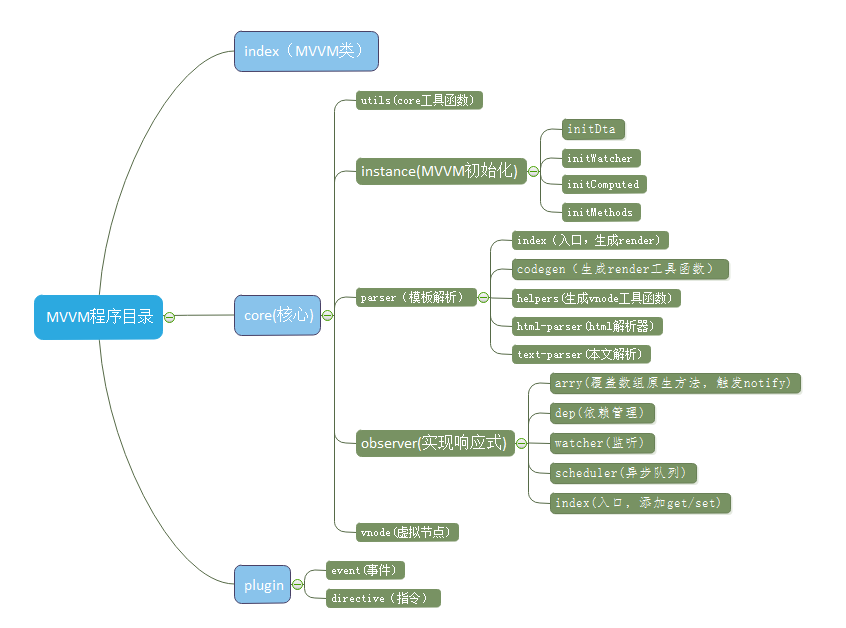

# 起源
最开始学习VUE的时候，网上找了很多源码解析，大多不够详尽或难以理解，于是自己写了一个类似VUE的框架（MVVM），整合网上解析与自己理解，尽量给每一句代码，添加解释,配备图形解释，让VUE通俗易懂；

#为什么用VUE
1，它能让团队书写用js更容易并且简化了js，上手难度低
2，优异的文档，一个帮组每一个人学习的强大社区，一个配套库的支持  https://cn.vuejs.org/
3，MVVM数据驱动,解放DOM操作
4，webpack=>vue-loader=>.vue文件;优秀的模块化解决方案
5，高效的性能,Virtual DOM + 基于es5的observe
6，更少的代码，VUE.use 以插件的形式，方便用户扩展与选择

# demo
gitdemo 网络不行，请刷新几下，耐心等待10S

http://htmlpreview.github.io/?https://github.com/fastCreator/MVVM/blob/master/dist/test.html

# 如何快速实现VUE框架
Vue 一个 MVVM 框架、一个响应式的组件系统，通过把页面抽象成一个个组件来增加复用性、降低复杂性

主要特色就是数据操纵视图变化，一旦数据变化自动更新所有关联组件~

所以它的一大特性就是一个数据响应系统，当然有了数据还需要一个模板解析系统

即 HTMLParse 帮我们把数据模板生成最终的页面，但每次数据变动都重新生成 HTML 片段挂载到 DOM 性能肯定慢的没法说

所以还需要 Virtual DOM 把最少的变动应用到 DOM 上，以提升性能

基本上述三项组装到一起也就出来了我们自己的 Vue 框架 MVVM

下面先介绍下 Virtual DOM

所谓的 Virtual DOM 就是用 JS 来模拟 DOM 树（因为 JS 操作比 DOM 快很多）

每次数据变动用新生成的树与之前的树做比对，计算出最终的差异补丁到真正的 DOM 树上

Vue 2.0 底层基于 Snabbdom 这个 Virtual DOM 做了优化与整合

### snabbdom
具体可以到这里查看更多 https://github.com/snabbdom/snabbdom

这个库的主要特色是简单、模块化方便扩展与出色的性能

一个简单例子
```bash
var snabbdom = require("snabbdom");
var patch = snabbdom.init([ // 初始化补丁功能与选定的模块
  require("snabbdom/modules/class").default, // 使切换class变得容易
  require("snabbdom/modules/props").default, // 用于设置DOM元素的属性(注意区分props，attrs具体看snabbdom文档)
  require("snabbdom/modules/style").default, // 处理元素的style，支持动画
  require("snabbdom/modules/eventlisteners").default, // 事件监听器
]);
var h = require("snabbdom/h").default; // 用于创建vnode,VUE中render(createElement)的原形

var container = document.getElementById("container");

var vnode = h("div#container.two.classes", {on: {click: someFn}}, [
  h("span", {style: {fontWeight: "bold"}}, "This is bold"),
  " and this is just normal text",
  h("a", {props: {href: "/foo"}}, "I\"ll take you places!")
]);
// 第一次打补丁，用于渲染到页面，内部会建立关联关系，减少了创建oldvnode过程
patch(container, vnode);
//创建新节点
var newVnode = h("div#container.two.classes", {on: {click: anotherEventHandler}}, [
  h("span", {style: {fontWeight: "normal", fontStyle: "italic"}}, "This is now italic type"),
  " and this is still just normal text",
  h("a", {props: {href: "/bar"}}, "I\"ll take you places!")
]);
//第二次比较，上一次vnode比较，打补丁到页面
//VUE的patch在nextTick中，开启异步队列，删除了不必要的patch
//nextTick异步队列解析，下面文章中会详解
patch(vnode, newVnode); // Snabbdom efficiently updates the old view to the new state
```
不难看出 patch 就是一个模块化的功能聚合，你也可以根据核心的 Hook 机制来提供自己的功能模块

然后通过 snabbdom/h 来创建 vnodes，最后用 patch 做更新处理

这个库的代码量不大，实现的非常灵活，有兴趣的可以读读源码，另外也建议读读这篇文章 https://github.com/livoras/blog/issues/13 以更好的了解内部原理

### HTMLParse
不过从上面的语法可以看出使用起来相当麻烦，所以我们需要一种简单的书写方式来帮我们解析成对应的语法规则

也就是要说的 HTMLParse

Vue 2.0 的 Parse 原型基于 John Resig 的 HTML Parser，这个 Parser 写的很小巧，可以到这里了解 http://ejohn.org/blog/pure-javascript-html-parser/

基本的 HTML 解析用法
```bash
var results = "";

HTMLParser(html, {
  start: function( tag, attrs, unary ) { //标签开始
    results += "<" + tag;

    for ( var i = 0; i < attrs.length; i++ )
      results += " " + attrs[i].name + "="" + attrs[i].escaped + """;

    results += (unary ? "/" : "") + ">";
  },
  end: function( tag ) { //标签结束
    results += "</" + tag + ">";
  },
  chars: function( text ) { //文本
    results += text;
  },
  comment: function( text ) { //注释
    results += "<!--" + text + "-->";
  }
});

return results;
```
可以看出它把 HTML 解析后对应的节点数据都传入了处理函数，Vue 在它的基础上做了升级与优化处理，在拿到对应的节点数据后做一些自己的解析处理，如 分析 v-if、v-for、v-on 等属性做指令处理，也就出来了 Vue 的模板系统~

#### 响应系统
下面在说下响应系统

数据响应主要是依据 ES5 的 getter 与 setter 来做数据变化的钩子处理，比如下面
```bash
Object.defineProperty(obj, key, {
  enumerable: true,
  configurable: true,
  get: ()=>{
    // VUE在此收集依赖，主要是计算属性,render watcher(视图渲染render)
    return val
  },
  set: newVal => {
    if(newVal === val)
      return
    val = newVal
    //VUE在此触发更新
  }
})
```
这样取值与赋值的过程中都可以做一些我们自己的处理，比如 set 的时候我们可以判断值是否真的发生了变化，变化了可以触发我们的重新渲染函数，做虚拟 DOM 比对处理更新界面

不过说明下并不是一旦有数据变动我们就要做重新渲染，看这个例子
```bash
 new Vue({
      template: `
        <div>
          <section>
            <span>name:</span> {{name}}
          </section>
          <section>
            <span>age:</span> {{age}}
          </section>
        <div>`,
      data: {
        name: "js",
        age: 24,
        height: 180
      }
    })

    setTimeout(function(){
      demo.height = 181
    }, 3000)
```
可以看到 height 的变动与我们的模板完全无关，如果做重渲染会造成浪费，所以 Vue 做了一个收集依赖

# 自己动手

### UML
什么是UML:UML是一组图示符号的标准。所谓图示符号，就是一组定义好的图示，它们可以表达定义好的各种意思。

作为程序员：使用UML能更好的描叙整个程序流程，更快的找出设计中存在的问题；发起头脑风暴，让程序更具创造性。

未来:利用UML几乎能将整个的代码通过UML表示出来，以后的编程趋势就是画UML，UML处理好了，机器自行根据UML完成代码编写，简化了软件的制作难度，任何人只要会画UML就把自己想实现的程序实现了。 

个人比较喜欢Edraw，国内的评价还是不错的哦

下面我们来开始自己动手写一个类似VUE的框架

### 实现思路
 

### 目录结构 
 

## 部分源码解析
### nextTick
1,实现方法（1,promise 2,MutationObserver 3，setTimeOut(0)）

2,vue依次优先

        macrotasks: setTimeout setInterval setImmediate I/O UI渲染
        
        microtasks: Promise process.nextTick Object.observe MutationObserver

        js分成很对task,当task执行完毕，必然执行ui渲染，如果用setTimeout那么UI会渲染两次

        优先promise，MutationObserver为微任务，task执行完毕，找到微任务，并执行，UI自渲染一次

        MutationObserver实现，查看源码可以知道每次timer都会触发一个DOM更新count=(count+1)%2,DOM更新便会触发回调

### watcher

计算属性get=>watchers.get  1,给dep.target赋值 2,watcher的value给计算属性缓存 

deep: true 递归watch

immediate: true 在创建watcher时就执行一次handler方法

sync: true 同步，直接执行watcher.run，否则要排队到queue数组中，等到nextTick异步到这里再依次执行

lazy: true 在创建watcher时是否需要立即计算当前watcher的value值，通过computed属性创建的watcher默认lazy=true不需要计算

### 如何添加依赖

添加依赖主要有三种：computed Watcher,user Watcher,render watcher

请注意Dep.target 静态属性可以表明但前状态为哪种watcher,当get一个值是根据当前状态，添加该watcher为依赖

### cache（Template）

VUE中使用cancel函数，以template为key,render函数为value,当我们的template没有变化时，能快速的获得render,避免了parse过程，提高了性能

### 具体代码实现

具体源码解析，请看src目录源码，已尽量给每一句代码添加注释
如有需要表达不够清楚或建议，请与我联系(237625092@qq.com)

#数据驱动
“上古时代”我们操作视图的基本步骤是： 

获取 DOM 对象（大多用 jQuery）

获取数据（用任何可能的途径，Ajax 很常见）

用新的数据“修改” DOM 对象，或者用新的数据创建新的 DOM 对象（HTML 字符串／模板＋数据对象）
更新 DOM

这个时候是不存在所谓“视图层”的——视图有，就是我们看得见摸得着的 DOM，但是没有框架层面的抽象视图层，对于视图的操作基本就是纯手工作坊式的。按照今天的话说这叫：以 DOM 为中心。

这种方式的缺点太多了，其中最重要的有两个：

视图没有设计良好的抽象层，你很难有条理的，层次结构分明的去构建 UI 视图
一切基于 DOM 的操作带来的是性能上的种种问题，因为 DOM 本身很重
然后有人就说了：我们开发应用其实关注的不应该是 DOM，而是数据本身，DOM 只是数据在浏览器里的具体呈现罢了（加上用于表征结构的 HTML 和表征视觉呈现的 CSS 等）。那么我们为什么要穷尽智慧和力气去和 DOM 徒手肉搏呢？我们为什么不能让框架／库为我们做这些事情，好让我们把注意力集中在数据层呢？（其实也就代表着业务逻辑，当数据流转到应用层时，它就是业务逻辑的负载）

于是传统的 MVC 分层理论就以各种各样的方式进入了前端开发的世界……这中间的细节就不多说了。

总之到了今天，像 vue.js 这样的现代框架就是做到了把 DOM 相关的事情隐藏到了框架底层并实现了高度的抽象设计和自动化操作（其实更重要的是对于状态的管理，等你再进阶一些就会体会到 DOM 操作的复杂性终究来源于无序状态的管理），所以作为应用开发者可以最大程度的只把精力放在数据层，也就是具体的业务逻辑上以及 UI 编程上去。

这就是数据驱动视图，你关注数据，框架替你处理视图操作。

#结语
希望大家看了本文能实现一个简单的MVVM
当然实现一个完整的东西还是有很多路要走的，希望大家都能越走越远，也能越走越近~

#相关文档 
1,基于 John Resig 的 HTML Parser https://johnresig.com/blog/pure-javascript-html-parser/

2,基于 snabbdom 的 Virtual DOM https://github.com/snabbdom/snabbdom

3,VUE API https://cn.vuejs.org/v2/api/

4,VUE 教程教程 https://cn.vuejs.org/v2/guide/

5,VUE官网仓库https://github.com/vuejs

6,VUE路由 https://router.vuejs.org/zh-cn/

7,VUEX  https://vuex.vuejs.org/zh-cn/

 